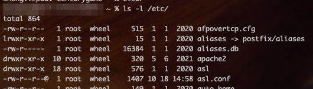

### 文件权限

`ls -l` 命令查看文件或文件夹权限

##### 第 1 字段：文件属性字段

可以看到，第一列由10个字符组成， 其中第一个字符表示文件类型：
- `-`表示该文件是普通文件
- `d`表示该文件是目录
- `l`表示该文件是一个链接文件
- `b`表示块设备文件（block），一般置于/dev目录下，设备文件是普通文件和程序访问硬件设备的入口，是很特殊的文件
- `c`表示该文件是一个字符设备文件(character)，一般置于/dev目录下，一次传输一个字节的设备被称为字符设备，如键盘、字符终端等，传输数据的最  小单位为一个字节
- `p`表示该文件为命令管道文件。与shell编程有关的文件
- `s`表示该文件为sock文件。与shell编程有关的文件

其后的9个字符，可以分为3组，有3个字符组成（`rw-`, `r--`, `r--`）。 这三组字符分别表示，该行所属用户本身具有的权限、所属用户的用户组其他成员的权限、其他用户的权限，

##### 第 2 字段： 链接占用的节点数。
该字段文件占用一个节点，属于软链接（符号链接）
如果是目录，则第2字段表示该目录所含子目录的个数
新建空目录，此目录的第二字段就是2，表示该目录下有两个子目录。因为每一个目录都有一个指向它本身的子目录"." 和指向它上级目录的子目  录".."，此默认子目录是隐藏的。
每次在目录下新建一个子目录，该目录第2字段的值就增1，但是新建一个普通文件该字段值不增加。

##### 第 3 字段：文件（目录）拥有者
该字段表示该文件拥有者是谁。只有文件的拥有者才具有改动文件属性的权利。root具有改动任何文件属性的权利。对于目录，只有拥有该目录的用  户，或者具有写权限的用户才有在目录下创建文件的权利。
前ID号的数字。

##### 第 4 字段：文件（目录）拥有者所在的组
一个用户可以加入很多个组，但是其中有一个是主组，就是显示在第4字段的名称。

##### 第 5 字段: 文件所占用的空间(以字节为单位)
表示文件大小，如果是目录，表示该目录大小。注意是目录本身大小，而非目录及其下面的文件的总大小。

##### 第 6 字段：文件（目录）最近访问（修改）时间

##### 第 7 字段：文件名